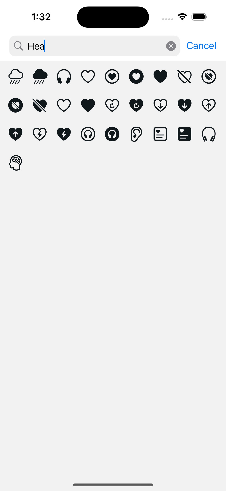
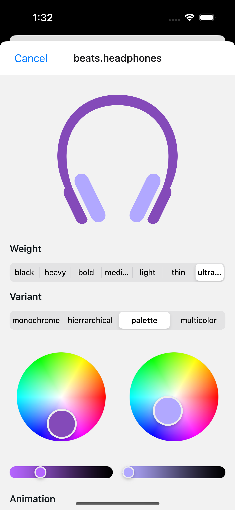

# 🔍 SF Symbols Lab — Built with Expo

Welcome to SF Symbols Lab — a handy little app built with [Expo](https://expo.dev) that lets you **search, preview, and customize** Apple’s SF Symbols.

With this app, you can:

- 🎨 Search through the full library of SF Symbols
- 🧰 Customize symbols with:
  - Weight (e.g. thin, light, bold, black)
  - Variant (e.g. monochrome, hierarchical, palette, multicolor)
  - Animation (pulse, bounce, etc.)
  - Tint color
  - Repeating
- ✨ See real-time previews of your changes

Built using [`@expo/symbols`](https://docs.expo.dev/versions/latest/sdk/symbols/) — powered by the system-native SF Symbols renderer.

---

## 🚀 Getting Started

Clone this repo and run the following:

```bash
npm install
npx expo start
```

This will open up Expo Dev Tools in your browser. From there, you can:

- Open the app in the iOS Simulator or Android Emulator
- Scan the QR code with the Expo Go app on your phone
- Use a development build if you've set one up

---

## Search and customize your favorite SF Symbols:

<div align="center">
  
  
</div>

---

## 🧪 Tech Stack

- Expo SDK
- React Native
- TypeScript
- `@expo/symbols` for SF Symbols support

---

## 🤝 Contributions

If you have ideas, improvements, or cool UI tweaks — feel free to open a PR!

---

## 📚 Learn More

- [Expo documentation](https://docs.expo.dev/)
- [Expo Symbols docs](https://docs.expo.dev/versions/latest/sdk/symbols/)
- [Apple SF Symbols](https://developer.apple.com/sf-symbols/)

---

Happy symbol hacking! ✌️
